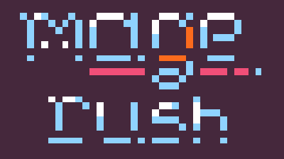

# Mage Rush

**A micro vampire-survivors like game, done for LowRezJam2023**.
Playable in-browser demo: https://iinacho.itch.io/mage-rush

Or just clone and cargo run. Have fun!

## Core loop

The session runs for 4 minutes and your goal is to survive. You have an unlimited dash (no cooldown) and a very unbalanced "difficulty management" system. 

After killing enemies, you earn XP and can level up, eventually. Leveling grants you a passive upgrade. There are 6 distinct in total.

Also there are three different type of enemies:
- A little slime that chases the Mage;
- A flying Bat, that spawns from left or right of the Mage;
- An evil plant-turret that shoots projectiles at the Mage.

## Why open source the game?

First of all, this was done for a game jam. Throughout the 14 days, I was learning many concepts of Rust and decided to go with Macroquad/Miniquad to aim for cross-platform code.

I'm aware that everything mutable everywhere might not be the best solution, but well, worked for this. :)

In any case, I'm confident this can be of help to someone also learning: either Rust, Macroquad/Miniquad or cross-platform portability.

I took many concepts from multiple source-codes as well, e.g. stopwatch implementation from Bevy, as it compiled properly to WASM32.

P.S.: I'm not a great game designer, so I can imagine some mechanics are very cheesy but I did try my best!

## What's next

Maybe I will update the game for a post-jam version with some improvements, maybe not. For instance, I would love to polish more and code proper collision avoidance.

Have a cool idea? Hit me up on Twitter: https://twitter.com/inacho_